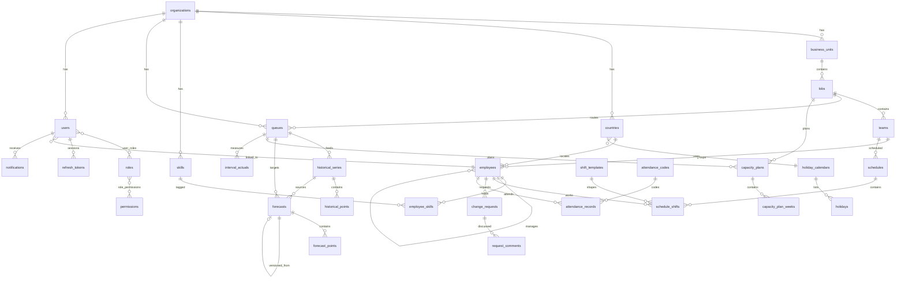

# Database Design

PostgreSQL in production, SQLite for zero-infra dev/tests — every column type is
dialect-portable (`Uuid`, `JSON`, `Date`, `DateTime(timezone=True)`).

## Conventions

- **UUID primary keys** everywhere (`UUIDMixin`), generated app-side.
- **Multi-tenancy**: every business table carries `organization_id` (FK → `organizations`,
  `ON DELETE CASCADE`, indexed) via `TenantMixin`.
- **Timestamps**: `created_at` / `updated_at` (server defaults) via `TimestampMixin`;
  employees add soft-delete (`deleted_at`).
- **Naming convention** pinned on `MetaData` so Alembic autogenerate is deterministic
  (`pk_%`, `fk_%`, `uq_%`, `ix_%`, `ck_%`).
- **Audit**: `audit_logs` is an append-only trail written by every mutating service call
  (actor, action, entity, before/after JSON).
- **History/versioning**: forecasts version through `parent_id` + `version`; refresh
  tokens are one-time-use rows; schedule publishing freezes rows immutable.
- Migrations: `alembic upgrade head` (initial revision `2523b4fd7fa4` creates all 30 tables).

## Tables by module

| Module | Tables |
|---|---|
| identity | `users`, `roles`, `permissions`, `user_roles`, `role_permissions`, `refresh_tokens`, `audit_logs` |
| workforce | `organizations`, `countries`, `business_units`, `lobs`, `teams`, `skills`, `queues`, `holiday_calendars`, `holidays`, `employees`, `employee_skills` |
| forecasting | `historical_series`, `historical_points`, `forecasts`, `forecast_points` |
| planning | `capacity_plans`, `capacity_plan_weeks` |
| scheduling | `shift_templates`, `schedules`, `schedule_shifts` |
| requests | `change_requests`, `request_comments` |
| attendance | `attendance_codes`, `attendance_records` |
| intraday | `interval_actuals` |
| notifications | `notifications` |

## ER diagram (core relationships)

## Key columns & constraints

- `users.email` — unique, lowercased on write.
- `refresh_tokens.token_hash` — unique SHA-256 of the JWT; `revoked_at` implements rotation.
- `employees (organization_id, employee_code)` — unique per tenant; `manager_id` self-FK.
- `queues` — carries SLA config (`sla_threshold_seconds`, `sla_target_pct`,
  `target_occupancy`, `concurrency`, `interval_minutes`) consumed by Erlang and intraday.
- `historical_points (series_id, day)` / `forecast_points (forecast_id, day)` — unique.
- `forecasts.status` — workflow enum-as-string: `draft → pending_approval → approved|rejected`.
- `capacity_plan_weeks (plan_id, week_start)` — unique; persisted computed outputs
  (`workload_hours`, `required_fte`, `available_hc`, `gap`) for reporting.
- `change_requests.status` — `pending_manager → pending_wfm → approved|rejected|cancelled`;
  `sla_due_at` drives overdue tracking.
- `attendance_records (employee_id, day, code_id)` — unique; lateness minutes derived
  from scheduled vs actual timestamps.
- `interval_actuals (queue_id, ts)` — unique upsert key for ACD feeds.
